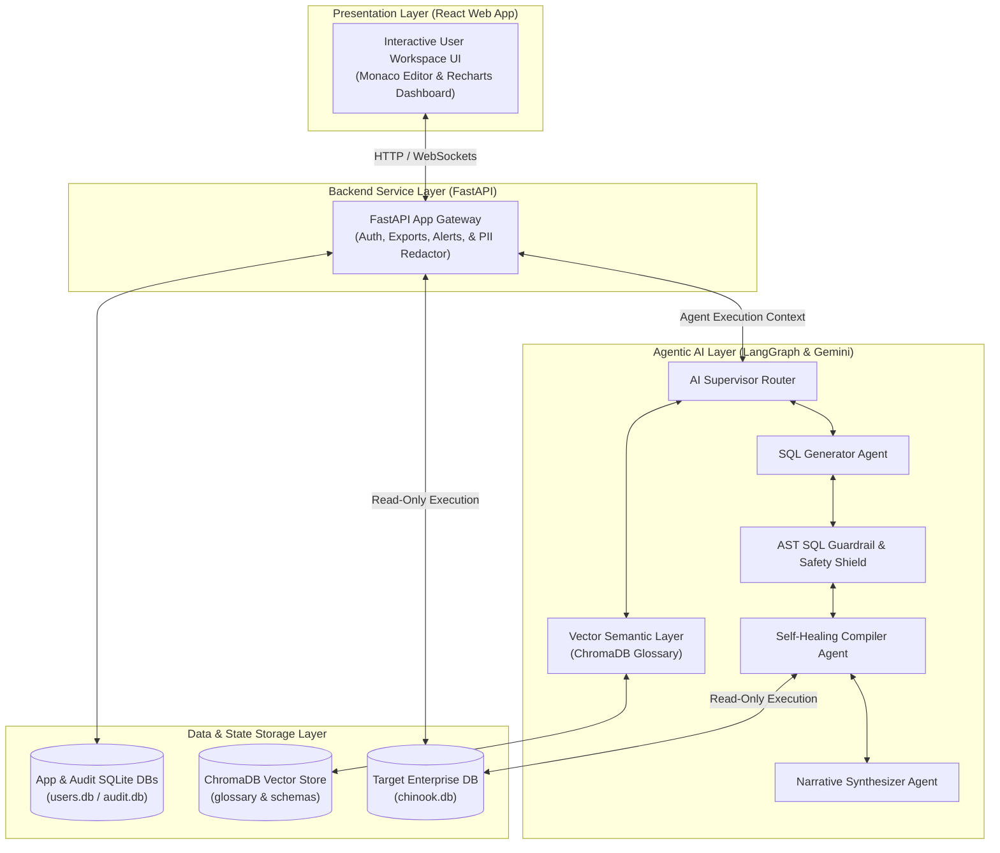
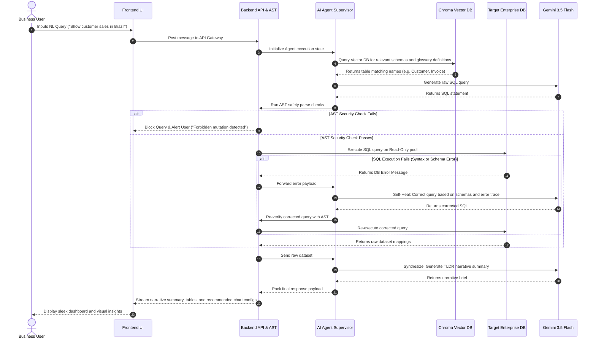

# Enterprise AI SQL Agent

An intelligent, self-healing, and secure Natural Language to SQL dashboard and collaboration platform. Empowering non-technical users to query databases in plain language, visualize results dynamically, collaborate in real-time, and run proactive anomaly alert scheduling.

> [!TIP]
> **Live Demo Test Credentials**:
> If you are testing the live deployed version, you can log in using the following credentials:
> * **Live Link**: `https://enterprise-sql-agent.onrender.com/`
> * **Username**: `test`
> * **Password**: `test`

---

## 1. Introduction

The **Enterprise AI SQL Agent** is a next-generation Business Intelligence (BI) and Data Operations platform. By combining advanced Large Language Models (LLMs), agentic state workflows, role-based security filters, and multiplayer dashboard canvasses, the platform democratizes access to complex relational databases. Users write natural queries, and the system handles SQL generation, compilation error recovery, data masking, and visual formatting securely.

---

## 2. About the Project

### The Problem
Traditional business intelligence requires a critical bottleneck:
1. **Specialized Knowledge**: Non-technical team members must wait for data analysts or engineers to write custom SQL.
2. **Slow Loop Cycles**: Converting a business hypothesis into a query, reviewing, correcting syntax, and generating charts takes hours or days.
3. **Compliance Risks**: Directly exposing databases to AI can leak sensitive Customer PII (SSNs, emails) or permit destructive queries (`DROP`, `DELETE`).

### The Solution
The Enterprise AI SQL Agent acts as a secure, smart intermediary layer:
* **Natural Language UI**: Business users query databases in plain language.
* **Agentic Self-Healing Loop**: If the generated query fails, the compiler agent analyzes the error stack trace, rewrites the query, and retries automatically.
* **AST Security Shield**: An Abstract Syntax Tree parser screens queries before execution, blocking modifying commands and catalog scraping.
* **Dynamic Visualization**: Auto-determines the best charts (Line, Bar, Radar) based on returned schemas and formats reports on the fly.

---

## 3. Features

* 📊 **Conversational Querying**: Natural Language to SQL translation with LLM-generated business narratives (TL;DR).
* 🔧 **Self-Healing Engine**: LangGraph state machine automatically catches database execution errors and corrects them (up to 3 retries).
* 🛡️ **AST Guardrails**: SQL parsing through `sqlglot` to enforce read-only execution and block table drops or unauthorized catalog access.
* 🎭 **PII Masking Filter**: Dynamic role-based redaction of emails, phone numbers, and addresses (Admin: full views, Analyst: obfuscated, General User: redacted).
* 📉 **Dynamic Chart Dashboards**: Interactive, glassmorphic dashboards using Recharts with real-time query executions.
* 🚨 **Proactive Alerts ("Smoke Detector")**: Background asyncio-scheduled checks monitoring critical metrics and logging threshold breaches.
* 👥 **Collaborative War Rooms**: Multiplayer canvas synchronizer tracking cursor coordinates and shared board updates over WebSockets.
* 📥 **Multi-Format Exports**: One-click slide decks (`pptx`), spreadsheet models (`xlsx` with SUM formulas), and document briefs (`pdf`).
* 🔌 **Slack Webhooks**: Bi-directional webhook controller supporting slash query commands (`/data-agent`).

---

## 4. Architectural & Flow Diagrams

### High-Level System Architecture


### Natural Language to Executable SQL (Self-Healing Loop) Flow


---

## 5. Tech Stack

* **Frontend**: React 19, Vite, TailwindCSS (for utility layout), Zustand (for multiplayer state management), Recharts (responsive SVG graphs), Monaco Editor (interactive code playground).
* **Backend**: FastAPI (Python 3.11), SQLAlchemy ORM (asyncpg, aiomysql, aiosqlite pools), SQLGlot (AST parsing).
* **Agentic Layer**: LangGraph (state management workflows), LangChain Core, ChatGoogleGenerativeAI (`gemini-3.5-flash`).
* **Databases**: SQLite (for light relational data files), ChromaDB (vector index search).
* **Document Compilation**: python-pptx (PowerPoint vectors), openpyxl (Excel workbooks), ReportLab (PDF layouts).

---

## 6. Project Folder Structure

```
SQL Agent/
├── Dockerfile                         # Production-grade multi-stage Docker build configuration
├── .dockerignore                      # Exclusion filters preventing local cache/node_modules copy
├── SRD.md                             # Software Requirements Document detailing specs
├── implementation_roadmap.md          # Chronological roadmap outlining phases of completion
├── data/                              # Local data directory for database storage
│   ├── chinook.db                     # Target business data SQLite database
│   ├── users.db                       # App database tracking user credentials & widgets
│   ├── audit.db                       # Security audit database recording query latencies
│   └── chroma/                        # ChromaDB persistent folder for vector collections
├── backend/                           # Backend service layer source files
│   ├── requirements.txt               # Declared Python module dependencies
│   ├── test_agent.py                  # CLI test runner executing LLM queries and safety logs
│   ├── test_security.py               # AST safety guard test script
│   └── app/                           # Core application module
│       ├── main.py                    # Root FastAPI startup & static folder configuration
│       ├── agents/                    # LangGraph agents directory
│       │   ├── sql_agent.py           # Self-healing SQL generator graph workflow
│       │   └── state.py               # Schema definitions for agent state context
│       ├── api/                       # API routing gateway
│       │   ├── routers/               # Endpoint controllers (auth, query, databases, alerts, exports)
│       │   └── schemas.py             # Pydantic models verifying API payloads
│       └── core/                      # Core backend utilities (auth middleware, database managers, safety checkers)
└── frontend/                          # React client application source files
    ├── package.json                   # Node package dependencies
    ├── vite.config.js                 # Vite configuration supporting backend API proxying
    └── src/                           # Client source assets
        ├── main.jsx                   # React application entry point
        ├── index.css                  # Core CSS variables and styles
        ├── components/                # Modular React interfaces
        │   ├── Landing.jsx            # Interactive client login / registration shell
        │   └── Workspace.jsx          # Client workspace container displaying tabs
        └── components/workspace/      # Tab panes (Console, Dashboard, Schema, Users, Alerts)
```

---

## 7. Local Setup

### Step 1: Clone the Repository
```bash
git clone https://github.com/your-username/SQL-Agent.git
cd SQL-Agent
```

### Step 2: Configure the Backend
1. Create a Python virtual environment and activate it:
   ```bash
   cd backend
   python3 -m venv .venv
   source .venv/bin/activate
   ```
2. Install Python packages:
   ```bash
   pip install -r requirements.txt
   ```
3. Create a `.env` file in the `backend/` folder:
   ```env
   DATABASE_URL=sqlite:///../data/chinook.db
   GEMINI_API_KEY=your_gemini_api_key_here
   ```
4. Start the FastAPI development server:
   ```bash
   uvicorn app.main:app --reload --port 8000
   ```

### Step 3: Configure the Frontend
1. Open a new terminal tab and navigate to the frontend folder:
   ```bash
   cd frontend
   ```
2. Install packages:
   ```bash
   npm install
   ```
3. Start the Vite development server (which proxies `/api` to port `8000`):
   ```bash
   npm run dev
   ```
4. Open `http://localhost:5173` in your browser.

---

## 8. API Endpoints

### Authentication Gateway
* `POST /api/v1/auth/register` - Create new user account.
* `POST /api/v1/auth/login` - Authenticate credentials and return JWT token.
* `GET /api/v1/auth/me` - Fetch authenticated user profile details.

### Databases & Schema Discovery
* `GET /api/v1/databases` - Retrieve permitted relational database connections.
* `POST /api/v1/databases` - Register a new connection (Admin only).
* `DELETE /api/v1/databases/{id}` - Disconnect database connections (Admin only).
* `GET /api/v1/tables` - Fetch list of user table names.
* `GET /api/v1/tables/{table_name}/schema` - Fetch table column specs and foreign keys.

### Natural Language Query & Chats
* `POST /api/v1/query` - Route query through LangGraph self-healing agent.
* `GET /api/v1/chats` - Fetch chat sessions.
* `POST /api/v1/chats` - Create a new chat session.
* `GET /api/v1/chats/{id}/messages` - Fetch message logs inside chat.

### Dashboards & Alerts
* `GET /api/v1/dashboard` - Fetch pinned metrics widgets.
* `POST /api/v1/dashboard` - Pin a new visual widget query.
* `GET /api/v1/alerts` - Retrieve anomaly alarm rules.
* `POST /api/v1/alerts` - Create a background scheduled metric checker.

### Exporter Engine
* `POST /api/v1/export/excel` - Download results as formatted Excel workbook.
* `POST /api/v1/export/pptx` - Export query, code, and narrative into a PowerPoint deck.
* `POST /api/v1/export/pdf` - Generate formal PDF intelligence reports.

---

## 9. Limitations & Future Enhancements

### Limitations
1. **SQLite Default Focus**: The generated agent logic defaults to SQLite queries. Although the connection pools support Postgres and MySQL, the dialect engine requires database selection flags in production for absolute dialect accuracy.
2. **Ephemeral Cloud Storage**: SQLite databases run inside the container. If deployed on free servers (like Render or Railway free tier) without active volume mounts, databases reset when containers spin down.
3. **AST Safety Checks**: Complex analytical window operations may trigger security false-positives under strict AST check guards.

### Future Enhancements
* **Database Agnostic Conversions**: Introduce fine-tuned dialect generators mapping schemas directly to PostgreSQL, Snowflake, or BigQuery environments automatically.
* **Auto-Alert push messaging**: Integrate Twilio, SendGrid, and Slack OAuth APIs for seamless push notifications on anomaly checks.
* **Metadata Caching Layer**: Add Redis queries to cache table structures, avoiding scanning database catalogs on every session launch.
* **Managed Database Migrations**: Support dynamic configurations migrating app metadata `users.db` to managed relational databases on cloud systems.
