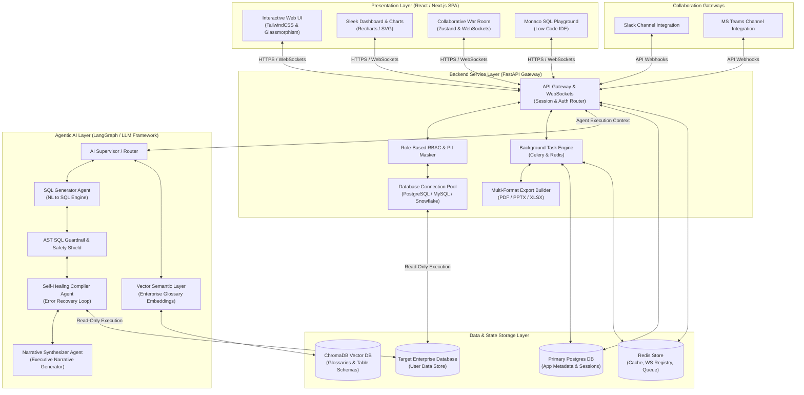
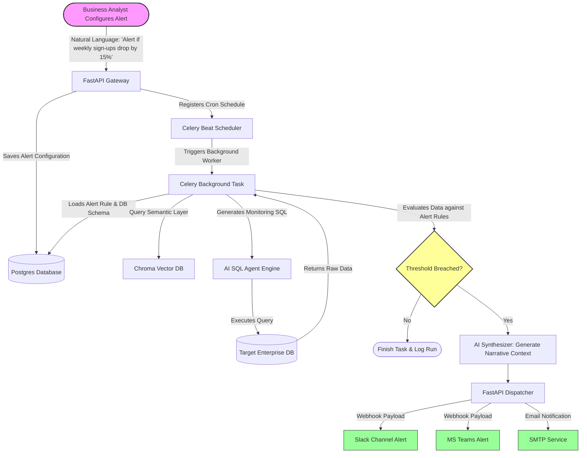
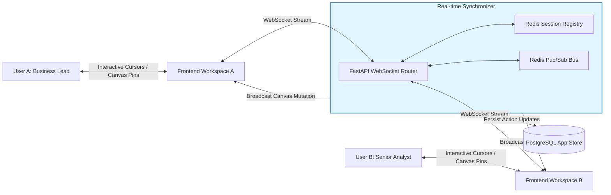
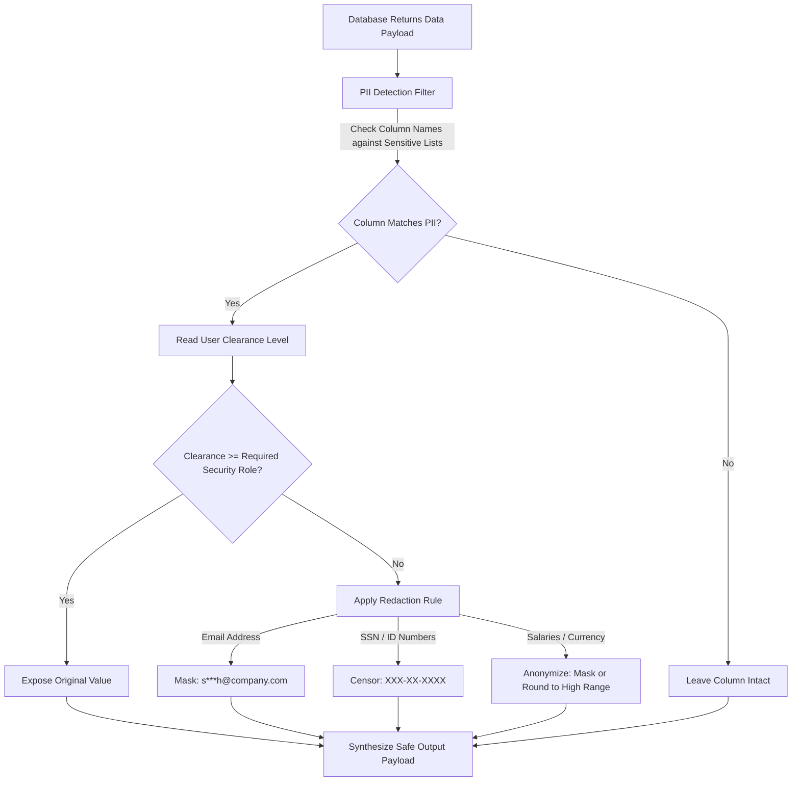
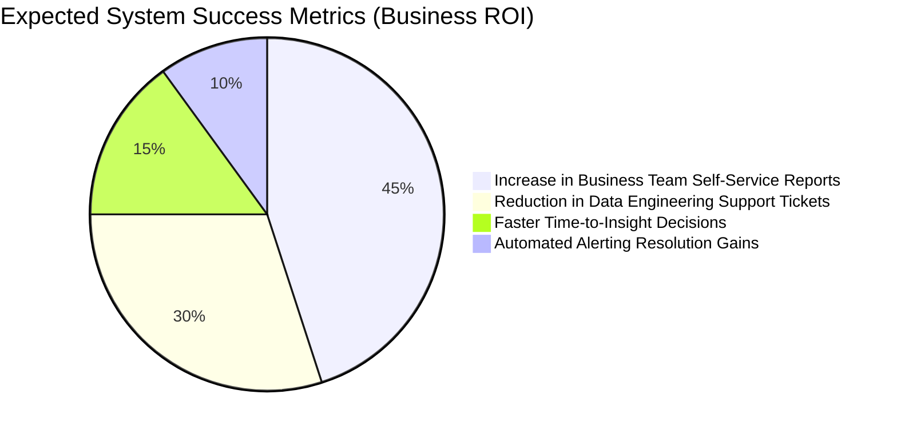

# Software Requirements Document (SRD)
## Project Name: Enterprise AI SQL Agent
**Document Version:** 1.0.0  
**Author:** Lead Business Analyst & Technical Architect  
**Status:** Approved for Technical Design  
**Date:** June 1, 2026

---

## 1. Executive Summary

### 1.1 Project Vision
The **Enterprise AI SQL Agent** is a next-generation Business Intelligence (BI) and Data Operations platform. By combining advanced Large Language Models (LLMs), agentic workflows (self-healing, verification, and plan formulation), and collaborative corporate features, the platform democratizes access to complex relational databases. It empowers non-technical executives and seasoned data analysts alike to query databases in plain natural language, obtain visual insights, collaborate in real time, and schedule automated business alerts—all within a secure, governed, and compliant environment.

### 1.2 Strategic Business Objectives
* **Democratize Data Access:** Eliminate the reliance on specialized SQL knowledge or data engineering queues to get operational answers.
* **Accelerate Time-to-Insight:** Reduce the lag between asking a business question and getting a verified, visualized, and summarized answer from hours to seconds.
* **Ensure Corporate Compliance:** Guarantee strict adherence to GDPR, CCPA, and HIPAA regulations by automatically redacting sensitive customer PII and securing critical tables.
* **Proactive Operational Management:** Shift organizational posture from reactive reporting to proactive alerting via natural language background monitoring.

---

## 2. Target Personas & User Profiles

| Persona | Role | Primary Goal | Critical Need |
| :--- | :--- | :--- | :--- |
| **Executive (C-Suite / VP)** | Strategic Decision Maker | Get quick, high-level business takeaways and trends. | Conversational summaries (TL;DR), polished PowerPoint/PDF exports. |
| **Business / Operations Analyst** | Departmental Researcher | Deep-dive into operational data, build dashboards, and track anomalies. | Chart customizations, self-healing queries, proactive background alerts. |
| **Data Steward / Security Officer** | Risk and Compliance Manager | Ensure data governance, block unauthorized access, audit AI queries. | Strict query guardrails, visual data lineage tracking, role-based PII masking. |
| **Team Member / Collaborator** | Operational Execution | Coordinate with team members on insights to resolve active incidents. | Collaborative workspaces (War Rooms), shared chat threads, Slack/Teams bot. |

---

## 3. High-Level System Architecture

The system utilizes a modern, decoupling-focused three-tier architecture: a highly interactive and collaborative **Frontend Presentation Layer**, a scalable **Backend Service Layer**, and a state-of-the-art **Agentic AI Orchestration Layer**.

### 3.1 Architecture Overview Diagram



---

## 4. Architectural Specs (Layer Breakdown)

### 4.1 Frontend Architecture
* **Framework:** React 18+ with Next.js App Router (for server-side pre-rendering and routing structure).
* **State Management:** Zustand (for localized workspace states, active connection sessions, dynamic chat logs, and real-time multiplayer states).
* **Styling & Aesthetics:** Vanilla CSS customized with CSS variables and TailwindCSS utilities, featuring dark-mode palettes, glassmorphism overlays, responsive grids, and subtle, micro-interactive transitions.
* **Interactive Charting:** Recharts (for fluid, responsive SVG-based charts with glowing line/bar gradients and interactive tooltip hover states).
* **Code Editor Integration:** Monaco Editor (integrated as an embeddable component supporting SQL syntax highlighting, schema auto-suggestions, auto-indentation, and dynamic compilation status).
* **Real-time Synchrony:** Native browser WebSockets connection connected to the backend Gateway, tracking mouse cursor updates, board actions, and live team messaging inside Collaborative War Rooms.

### 4.2 Backend Architecture
* **Core API Framework:** FastAPI (Python) for asynchronous, high-throughput request handling and integrated WebSocket protocols.
* **Database Connection Gateway:** SQL Alchemy ORM combined with asyncpg/aiomysql driver pools, allowing secure, parallelized read-only query routing to PostgreSQL, MySQL, SQLite, and Cloud Data Warehouses (Snowflake).
* **Task Queuing & Scheduling:** Celery backed by Redis for executing and scheduling background alerting operations, sending Teams/Slack payloads, and heavy CPU-bound document exports.
* **Session Storage & Cache:** Redis for storing dynamic user workspace data, current database metadata caches, rate-limiting counters, and synchronized cursor coordinate mappings.
* **Application DB:** PostgreSQL for persisting registered database connections, user details, access roles, saved SQL snippets, glossary items, and history audit records.

### 4.3 AI & Agentic Orchestration Layer
* **Agent Framework:** LangGraph / LangChain Agents, utilizing state machines to structure recursive loops (such as query correction and table relevance checking).
* **Linguistic Semantic Layer:** ChromaDB (Vector Database) for storing embedded definitions of customer database schemas, sample records, and localized business terminology mappings (glossaries).
* **AST Security Shield:** A custom Python AST (Abstract Syntax Tree) SQL parser that strictly analyzes generated queries before execution. It prevents destructive actions (`DROP`, `DELETE`, `INSERT`) and intercepts sensitive column paths to verify user roles.
* **LLM Engine:** Advanced conversational models (such as Gemini 1.5/2.0 or GPT-4o) coordinated by localized system instructions tailored for SQL construction, logical self-correction, and boardroom narrative synthesis.

---

## 5. Key System Workflows & Flow Diagrams

### 5.1 Workflow 1: Natural Language to Executable SQL (Self-Healing Loop)

```mermaid
sequenceDiagram
    autonumber
    actor User as Business User
    participant FE as Frontend UI
    participant BE as Backend API & AST
    participant AG as AI Agent Supervisor
    participant VDB as Chroma Vector DB
    participant DB as Target Enterprise DB
    participant LLM as LLM Engine

    User->>FE: Inputs Natural Language query ("Show sales of top products")
    FE->>BE: Post message to API Gateway
    BE->>AG: Initialize Agent Execution Context
    AG->>VDB: Query Vector DB for relevant schemas and business glossary
    VDB-->>AG: Returns matching tables and definitions (e.g. "sales" -> "orders")
    AG->>LLM: Generate raw SQL query based on schemas and user request
    LLM-->>AG: Returns generated SQL query
    AG->>BE: Pass query to AST Guardrail Engine for safety check
    
    alt AST Security Verification Fails
        BE-->>FE: Block Query & Alert User ("Unauthorized or destructive query detected")
    else AST Security Verification Passes
        BE->>DB: Execute SQL query on Read-Only connection
        
        alt SQL Execution Fails (Engine Error / Schema Misalignment)
            DB-->>BE: Returns DB Error Message (e.g. "Column 'product_id' does not exist")
            BE->>AG: Forward error payload
            AG->>LLM: Self-Healing: "Explain the error and rewrite the query"
            LLM-->>AG: Returns corrected SQL query
            AG->>BE: Re-verify corrected query via AST
            BE->>DB: Re-execute corrected SQL query
        end
        
        DB-->>BE: Returns raw dataset (Rows & Columns)
    end

    BE->>AG: Send raw dataset
    AG->>LLM: Synthesize: Generate conversational summary (TL;DR) & recommend chart type
    LLM-->>AG: Returns narrative summary and chart configuration
    AG-->>BE: Formulate final response payload
    BE-->>FE: Stream conversational narrative, raw data tables, and pre-built chart configurations
    FE-->>User: Display sleek visual dashboard and natural language insights
```

---

### 5.2 Workflow 2: Proactive "Smoke Detector" & Alerting



---

### 5.3 Workflow 3: Collaborative Data "War Room" Canvas Session



---

## 6. Functional Requirements (Deep Dive)

### 6.1 Core SQL Intelligence Engine (FR-1)
* **FR-1.1: Automated Introspection.** The system must automatically read database catalogs to discover tables, column names, keys, indexes, and schemas upon connection.
* **FR-1.2: Dynamic Schema Pruning.** The AI agent must filter out unrelated schemas and only inject query-relevant schemas into the LLM context to prevent token wastage.
* **FR-1.3: Self-Healing SQL Generation.** The compiler agent must intercept SQL database errors, interpret the stack trace, correct the syntax or structural error, and attempt re-execution up to 3 times before returning an error page.
* **FR-1.4: Real-time SQL Linter.** The system must parse and lint generated queries to verify compatibility with target database dialects (e.g. SQLite, PostgreSQL, MySQL, Snowflake).

### 6.2 Decision-Support Experience (FR-2)
* **FR-2.1: Executive "TL;DR" Narratives.** Every data result must be accompanied by an AI-generated concise business summary highlighting key takeaways, trends, and business impact.
* **FR-2.2: Automated Chart Configurations.** The system must auto-suggest the optimal visual layout (Line, Bar, Radar, Scatter) based on structural data analysis of the result payload.
* **FR-2.3: Visual Audit Lineage Panel.** Users must be able to open a side drawer mapping the system’s execution steps, tables accessed, generated SQL, execution speed, and database connection state.
* **FR-2.4: Interactive Shared Canvas ("War Rooms").** Teams must be able to initialize persistent, shared board-style spaces where they can pin generated queries, post charts, write sticky notes, leave comments, and track remote user cursors in real time.
* **FR-2.5: Multi-Format Pitch Exporter.** Users must have a single-button option to export workspace boards or chat threads into formatted PowerPoint slides (with editable charts), executive PDF reports, or dynamic formulas-included Excel sheets.

### 6.3 Enterprise Integration & Automation (FR-3)
* **FR-3.1: Natural Language Alert Scheduler.** Users must be able to speak or type background monitoring rules (e.g. *"Alert our Slack channel if active checkouts drop by 10% compared to yesterday"*).
* **FR-3.2: Celery Background Daemon.** Alert rules must run reliably in background threads via scheduled Celery cron workers at configured time increments.
* **FR-3.3: Slack / Microsoft Teams Webhook Integrations.** The system must support bi-directional communication channels. Slack users can invoke the bot (`/data-agent query [message]`) to get back direct inline tables, summaries, and charts inside active conversations.

---

## 7. Data & Security Governance Requirements

### 7.1 Role-Based PII Redaction Policy
To enforce absolute compliance with global data privacy initiatives, the platform integrates a dynamic PII (Personally Identifiable Information) Redaction Engine that processes data payloads between the database fetch and the frontend presentation layers.



### 7.2 Core Security Policies
* **Read-Only Database Connection Pools:** Every target database hookup must enforce strict, single-user read-only connection profiles, blocking any administrative or data editing scripts before reaching the network port.
* **AST SQL Inspection:** Every AI-generated query must be verified by the backend AST Parser. If keywords like `DROP`, `UPDATE`, `DELETE`, `TRUNCATE`, `ALTER`, `GRANT`, or unauthorized nested subqueries are discovered, execution is instantly blocked and flagged as a security hazard.
* **Data Transit Security:** Enforce absolute TLS 1.3 encryption protocols for all data flying between the Frontend Client, Backend Gateway, and the Target Enterprise Databases.

---

## 8. Non-Functional Requirements (NFRs)

### 8.1 Performance & Scalability
* **Query Optimization Latency:** The AI SQL generation and AST verification pipeline must complete within 2.5 seconds (excluding database execution speed).
* **Concurrent WebSocket Sessions:** The real-time synchronizer must support up to 5,000 parallel WebSocket canvas connections without degrading state synchronization latencies (keeping sync delays under 150ms).
* **Database Pooling Throughput:** The backend gateway must support up to 250 persistent target database pools dynamically active simultaneously.

### 8.2 Reliability & High Availability
* **Self-Correction Threshold:** AI query self-healing loops must strictly timeout and fail gracefully after 3 failed correction cycles, returning a constructive visual troubleshoot dashboard.
* **Alert Execution Fail-Safe:** Background Celery scheduling tasks must implement retry and exponential backoff policies to prevent skipped database tracking alerts during intermittent network lag.

### 8.3 Accessibility & Adaptability
* **Modern Web Standards Compliance:** Interactive web interfaces must maintain semantic HTML structures, unique testing IDs for browser automation frameworks, and fit visual contrast guidelines (WCAG 2.1 AA compliance).
* **Responsive Visual Frameworks:** Layout designs must adjust dynamically across varying desktop monitor configurations, tablets, and mobile screens.

---

## 9. System Success Metrics (KPIs)

To evaluate the operational success of the deployed SQL Agent platform, the business will monitor the following high-level performance indicators:



* **Data Team Efficiency:** Minimize manual SQL reporting support tickets sent to standard data engineering teams by 60% within the first 6 months.
* **Executive Adoption Speed:** Target an active user engagement rate above 85% for non-technical leadership teams utilizing the conversational Slack/Teams integrations and one-click PDF/PPTX exporters.
* **Self-Healing Success Rate:** Maintain an automated AI-healing success rate of 92% or higher on syntactical query errors without requiring human-in-the-loop developer intervention.
