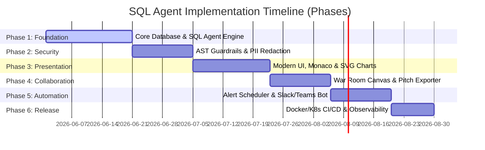
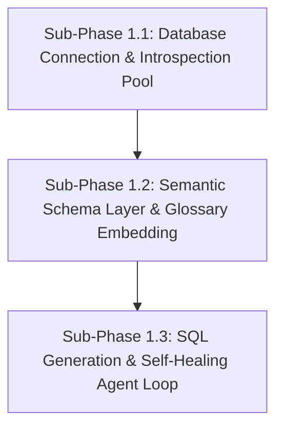
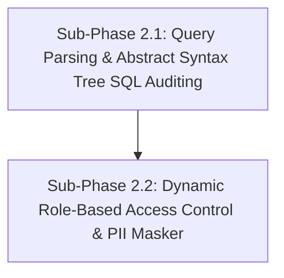
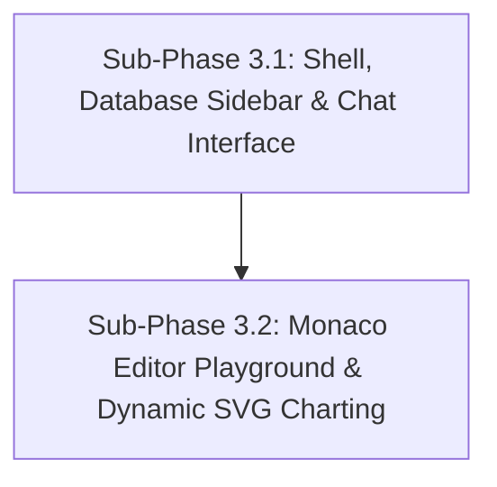
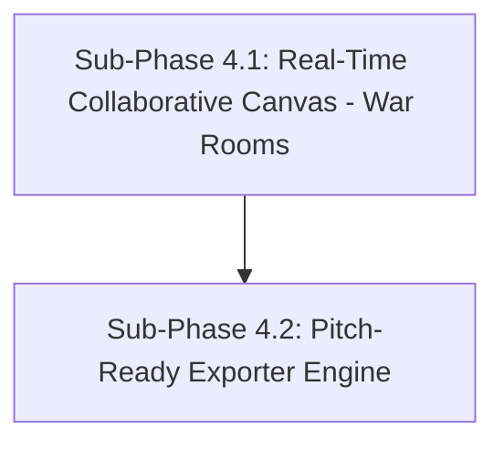
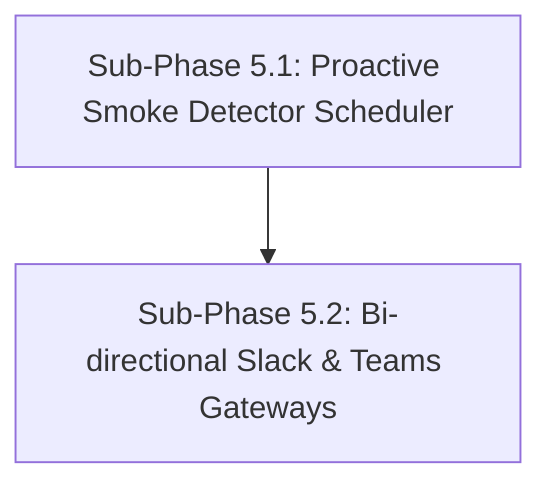
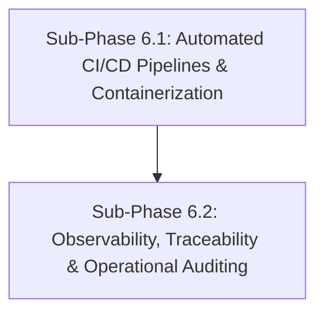

# Project Implementation Roadmap: Enterprise AI SQL Agent
**Document Version:** 1.0.0  
**Status:** Ready for Engineering Execution  
**Author:** Technical Program Manager & Senior Business Analyst  
**Date:** June 1, 2026

---

## 1. Executive Roadmap Overview

This document defines the structured, phase-by-phase implementation plan required to transition the **Enterprise AI SQL Agent** from dynamic conceptual specifications to a fully deployed, high-availability production application. 

The roadmap is structured into **6 major sequential phases**, each representing a distinct "unit task" that delivers an end-to-end working component of the system. Each phase is subdivided into modular sub-phases, tasks, and recursive sub-tasks, complete with clear dependencies, technical specifications, concrete deliverables, and Business Analyst validation criteria.

---

## Phase 1: Core SQL Intelligence Engine (The Foundation)
* **Goal:** Build the essential backend database connectivity, semantic mapping pipelines, and self-healing LLM agent loops. This phase is entirely focused on API and Agent correctness before introducing security filters or visual screens.
* **Dependencies:** None.

### Sub-Phase 1.1: Database Connection & Introspection Pool
* **Task 1.1.1: Multi-Driver DB Registry**
  * Establish connection adapters using async drivers (`asyncpg` for Postgres, `aiomysql` for MySQL, plus SQLite and Snowflake drivers).
  * Build a centralized connection factory interface returning standardized, dynamic, read-only connections.
* **Task 1.1.2: Dynamic Schema Discovery Engine**
  * Write introspection queries to retrieve catalog metadata (table configurations, column indexes, primary keys, foreign relations).
  * Format database structural configurations into neat JSON schemas for the AI agent context.
* **Expected Output:**
  * Dynamic, testable connection utility modules.
  * API endpoints (`GET /api/v1/database/schema`) returning fully structured JSON schema layouts of any targeted database.

### Sub-Phase 1.2: Semantic Schema Layer & Glossary Vectorization
* **Task 1.2.1: Vector DB Setup (ChromaDB Integration)**
  * Spin up ChromaDB instance.
  * Design vector schemas to index table schemas, column summaries, and sample rows.
* **Task 1.2.2: Semantic Glossary Mapping Manager**
  * Write glossary ingestion scripts matching custom business terminology with target database SQL filters (e.g. mapping "active user" to a set of query constraints).
  * Write vector search queries to perform semantic calculations matching incoming questions with mapped schema terms.
* **Expected Output:**
  * ChromaDB vector persistence layers.
  * Glossary API router supporting semantic matching validations (`POST /api/v1/glossary/resolve`).

### Sub-Phase 1.3: SQL Generation & Self-Healing Agent Pipeline
* **Task 1.3.1: Table Relevance Selector Agent**
  * Construct a system agent using LangGraph to analyze user questions, pull semantically related schemas, and filter down target tables.
* **Task 1.3.2: SQL Query Generation Engine**
  * Construct the primary SQL agent, supplying custom system prompts matching the dialect of the targeted database.
* **Task 1.3.3: Self-Healing Compiler Execution Loop**
  * Build execution pipelines executing generated SQL inside the connection wrapper.
  * Integrate self-healing logic: If compilation errors occur, package error details and send them back to the LLM agent to rewrite and re-execute.
* **Expected Output:**
  * Multi-agent execution pipelines implemented using LangGraph.
  * Core evaluation metrics API endpoint (`POST /api/v1/query/chat`) returning the final dataset, generated SQL, self-healing try logs, and conversational summary narratives.

### 🔍 Business Analyst Validation Checklist (Phase 1 Gate)
- [ ] Connects successfully to test PostgreSQL, SQLite, and MySQL databases.
- [ ] Generates valid SQL queries matching conversational questions.
- [ ] Successfully self-heals from missing column/table names by updating schema lookups and rewriting queries within 3 loops.
- [ ] Translates raw tabular results back into clear natural language.

---

## Phase 2: Security, Governance & AST Auditing
* **Goal:** Wrap the foundation layer in an enterprise-grade security layer, ensuring absolute read-only execution, blocking malicious code, and dynamically masking sensitive user records.
* **Dependencies:** Complete Phase 1.

### Sub-Phase 2.1: Query Parsing & Abstract Syntax Tree (AST) SQL Auditing
* **Task 2.1.1: AST Statement Analyzer (Read-Only Guard)**
  * Implement Python SQL Parser library (`sqlglot` or standard `sqlparse`) to convert AI-generated SQL strings into Abstract Syntax Tree objects.
  * Develop AST checkers that automatically block any statement containing DDL (`DROP`, `ALTER`, `CREATE`) or DML (`DELETE`, `UPDATE`, `INSERT`) tags.
* **Task 2.1.2: Dynamic Tokenizer & Query Shield**
  * Enforce strict query length, nesting depths, and execution time limits.
* **Expected Output:**
  * AST parser module executing security audits in under 15ms.
  * Query execution gate yielding standardized security alerts for forbidden queries.

### Sub-Phase 2.2: Dynamic Role-Based Access Control & PII Masking
* **Task 2.2.1: Dynamic User Metadata Integration**
  * Build middleware linking target user clearance roles (e.g. *Admin, Analyst, HR, General*) to API requests.
* **Task 2.2.2: Dynamic Column-Level Masking Engine**
  * Map database columns containing highly sensitive information (e.g., SSN, passwords, credit card numbers).
  * Build post-execution middleware that intercepts rows returning sensitive keys and applies masking rules (e.g., replacement tokens, partial masking, hashing) based on the user's role.
* **Expected Output:**
  * Dynamic PII Masking processor class.
  * Clear security policies configuration file defining role-based column access.

### 🔍 Business Analyst Validation Checklist (Phase 2 Gate)
- [ ] Blocks direct injection attempts like `DROP TABLE users;` or malicious nested subqueries.
- [ ] Prevents general business users from viewing sensitive HR salary figures or contact numbers.
- [ ] Confirms the AST parser runs instantly (adds < 25ms of overhead to query times).

---

## Phase 3: High-Fidelity Presentation Layer (Frontend Core)
* **Goal:** Create a visual experience that is modern, beautiful, responsive, and dynamic, featuring premium styling, an interactive Monaco playground, and custom SVG charting.
* **Dependencies:** Complete Phase 2.

### Sub-Phase 3.1: Modern Shell, Database Sidebar & Chat Interface
* **Task 3.1.1: Core Design System Setup (Aesthetic Layer)**
  * Set up `index.css` using custom variable sets (glowing dark themes, curated warm colors, and glassmorphic card overlays).
  * Set up premium Google Fonts (e.g., *Inter, Outfit*).
* **Task 3.1.2: Interactive Database Sidebar & ERD Drawer**
  * Build dynamic ERD table widgets displaying relational lines on hover.
  * Build a chat console stream with premium transitions, markdown output tables, code block syntax highlighting, and an expandable thought process console.
* **Expected Output:**
  * Modular design components structured inside Next.js.
  * Responsive, glassmorphic layout shell with database schema sidebar.

### Sub-Phase 3.2: Monaco Editor Playground & Dynamic SVG Charting
* **Task 3.2.1: Monaco SQL Code Editor Integration**
  * Embed Monaco Editor inside a split-screen canvas workspace.
  * Hook up auto-complete tables, columns, and SQL syntax suggestions based on the fetched schemas.
* **Task 3.2.2: Dynamic SVG Chart Generator**
  * Build modular, highly responsive charts utilizing `Recharts`.
  * Set up auto-visualization handlers matching backend chart configurations (e.g., converting time-series to Line charts with custom glowing gradient fills).
* **Expected Output:**
  * Reusable charting component library.
  * Split-screen workspace providing raw datasets and interactive code-editing tools.

### 🔍 Business Analyst Validation Checklist (Phase 3 Gate)
- [ ] Interfaces adjust dynamically across mobile, tablet, and wide desktop screens.
- [ ] The Monaco editor successfully auto-suggests table and column names as the user writes custom SQL queries.
- [ ] Generated charts render immediately with custom dark-theme colors, glowing gradient backgrounds, and interactive tooltips.

---

## Phase 4: Collaborative Intelligence & Team Integration
* **Goal:** Implement multi-user collaboration workspaces (War Rooms) with real-time screen synchronization and a multi-format document exporter.
* **Dependencies:** Complete Phase 3.

### Sub-Phase 4.1: Real-Time Collaborative Canvas (War Rooms)
* **Task 4.1.1: WebSocket Gateway Setup**
  * Build WebSocket handlers on FastAPI to track interactive canvas updates.
  * Setup Redis Session Registry tracking active users per "War Room" canvas.
* **Task 4.1.2: Multiplayer Action Streamer**
  * Write client-side canvas synchronization logic updating mouse positions, pin coordinates, and widget layout changes.
  * Develop cursor components that render remote cursor movements and names on user screens with zero-latency synchronization (< 100ms sync delay).
* **Expected Output:**
  * WebSocket controller services.
  * Persistent, multi-user War Room whiteboard canvas page.

### Sub-Phase 4.2: Pitch-Ready Exporter Engine
* **Task 4.2.1: PDF/PPTX/Excel Document Layout Compiler**
  * Implement background compilation pipelines utilizing standard Python layout libraries (`python-pptx` for editable PowerPoint slides, `ReportLab` for PDFs, `openpyxl` for Excel grids).
  * Build one-click frontend export widgets.
* **Expected Output:**
  * Backend exporter service hooks (`POST /api/v1/export`).
  * One-click download files containing structured, branded corporate reports.

### 🔍 Business Analyst Validation Checklist (Phase 4 Gate)
- [ ] Two users in a shared "War Room" see each other's live cursor updates and board card changes instantly.
- [ ] Exported PowerPoint files contain native, editable vector graphs, not flattened images.
- [ ] Exported Excel files load cleanly with working math formulas (e.g., column sums) pre-applied.

---

## Phase 5: Background Automation & Corporate Messaging Hooks
* **Goal:** Build the proactive "Smoke Detector" background alert scheduler and integrate bidirectional enterprise messaging workflows (Slack and Teams).
* **Dependencies:** Complete Phase 4.

### Sub-Phase 5.1: Proactive "Smoke Detector" Scheduler
* **Task 5.1.1: Natural Language Alert Parser**
  * Build conversational alert rule compilation: Users describe anomaly parameters (e.g. *"Alert when sign-ups drop by 15% compared to 7-day average"*).
  * Convert conversational parameters into static scheduled SQL monitoring check tasks.
* **Task 5.1.2: Celery Beat Background Worker Daemon**
  * Establish Celery Beat scheduler executing queries in read-only background workers.
  * Set up threshold comparison logic evaluating fresh datasets against active alarm rules.
* **Expected Output:**
  * Background worker engine integrated using Celery & Redis.
  * Active monitoring management screen in the user UI.

### Sub-Phase 5.2: Bi-directional Slack & Teams Gateways
* **Task 5.2.1: Enterprise Messaging Webhook Controllers**
  * Build webhook listeners matching Slack slash commands (`/data-agent`) and Microsoft Teams app events.
  * Develop response builders formatting analytical tables, visualizations, and summary summaries into card block structures.
* **Expected Output:**
  * Fully integrated Enterprise Slack and Teams webhook adapters.
  * Dynamic messaging layouts that render charts and insights natively inside Slack/Teams threads.

### 🔍 Business Analyst Validation Checklist (Phase 5 Gate)
- [ ] Triggering an alert successfully formats a rich notification block showing diagnostic metrics.
- [ ] Alert notifications deliver within 10 seconds of background query execution when an anomaly threshold is breached.
- [ ] Querying the bot inside Slack with `/data-agent` returns inline summaries and charts.

---

## Phase 6: Deployment, Monitoring & Operational Rollout
* **Goal:** Configure containerized multi-stage deployments, scalable pipelines, system observability tracing, and a secure audit logging infrastructure.
* **Dependencies:** Complete Phase 5.

### Sub-Phase 6.1: Automated CI/CD Pipelines & Containerization
* **Task 6.1.1: Multi-Stage Dockerization**
  * Write Dockerfiles optimized for multi-stage compiles (Node.js React builder + Python FastAPI service + Background Celery workers).
  * Create orchestration configurations (`docker-compose.yml` for local testing, Kubernetes/ECS templates for production).
* **Task 6.1.2: Automated Integration CI/CD Scripting**
  * Configure GitHub Actions or GitLab CI automated linting, unit testing, image building, and continuous deployments.
* **Expected Output:**
  * Production-optimized Dockerfiles and Helm charts.
  * Fully automated, green-verified CI/CD pipelines.

### Sub-Phase 6.2: Observability, Traceability & Operational Auditing
* **Task 6.2.1: Agent Performance Tracing**
  * Hook up agentic evaluation trace instrumentation (using LangSmith or OpenTelemetry) to monitor query routes, LLM token consumption, and retrieval steps.
* **Task 6.2.2: Tamper-Proof Security Log Audit Trail**
  * Design isolated logging tables inside PostgreSQL recording security query attempts, AST verification flags, PII access levels, and execution timings.
* **Expected Output:**
  * Integrated tracing and system telemetry dashboards.
  * Secured, tamper-proof system audit database schema.

### 🔍 Business Analyst Validation Checklist (Phase 6 Gate)
- [ ] Application builds compile, pass automated integration tests, and containerize without errors.
- [ ] Dynamic tracing dashboards show exact agent step logs and execution bottlenecks.
- [ ] Security logs capture a record of every user request, generated SQL statement, and AST security flag.

---

## 3. Comprehensive Phase-to-Phase Verification Criteria Matrix

To ensure absolute system quality, transition between any phase requires completing the following verification gates:

| Gate | Focus | Technical Requirements | Business BA Clearance |
| :--- | :--- | :--- | :--- |
| **Phase 1 to 2** | *Core Engine Correctness* | LangGraph loop executes without circular errors. Dialect translation maps clean SQL queries. | AI successfully converts conversational queries into readable answers. |
| **Phase 2 to 3** | *Strict Security Guard* | AST intercepts all unauthorized queries. Column masking applies within 10ms. | Confidential information is redacted when queried by low-clearance roles. |
| **Phase 3 to 4** | *UI Performance* | Monaco suggestions index dynamic schemas. SVG charts scale cleanly. | Interactive charts and user layouts load quickly on all target screens. |
| **Phase 4 to 5** | *Collaboration Reliability* | WebSocket latency matches < 100ms. PDF/Excel compiles output cleanly. | Exporters output presentation-ready slides and Excel spreadsheets. |
| **Phase 5 to 6** | *Automation Stability* | Celery background runners process rules. Slash hooks format clean messaging layouts. | Alerts fire automatically when thresholds are breached, delivering rich Slack charts. |
| **Phase 6 Deployment** | *Production Readies* | Automated builds pass pipelines. Dynamic tracing and audit logging are active. | Security audits verify complete operational trace logging. |
